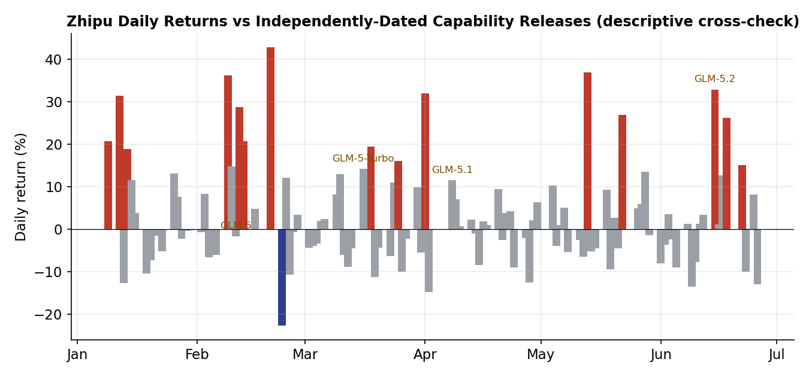

# Capability Surprise, Not Earnings Surprise
### An event-driven read of how the market prices an early-commercial-stage AI lab (Zhipu, 2513.HK)

> Data as of **2026-06-26**. A foundation-model lab has **no earnings to be surprised by**. So we replace the
> classic *earnings* surprise with a **capability surprise** — a model release or benchmark-leaderboard jump —
> and ask the only question that matters for market efficiency: *does the price react once and stop, or does it
> keep drifting?* This is the AI analogue of post-earnings-announcement drift (PEAD) → **PCAD**.
>
> Method: mean-adjusted abnormal returns on authoritative Tushare/HKEX prices, three windows — leakage
> `[-5,-1]`, reaction `[0,+1]`, drift `[+2,+10]`; robustness via peer-adjustment (benchmark = MiniMax).

---

## 1. The data finds the events before we tell it the dates
We flagged Zhipu's largest abnormal up-days *blind*, then checked them against the GLM release log. They line
up almost one-for-one:

| Data-found spike | Daily ret | Matches |
|---|---|---|
| 2026-02-09 → 02-11 | +36% | **GLM-5** launch |
| 2026-04-01 | +32% | run-up *into* **GLM-5.1** (leakage) |
| 2026-06-15 | +33% | **GLM-5.2** launch (first trading day after 06-13) |
| 2026-02-20 / 05-13 | +43% / +37% | **non-capability: index/flow** (Hang Seng Tech inclusion + Stock Connect anticipation) |

The two flow-driven spikes are themselves a finding: not every move is capability — some is index/liquidity.
See `figures/fig2_daily_returns.png`.

## 2. Reaction is loud; drift is where efficiency breaks
Average CAR across the four GLM events (mean-adjusted):

| Window | Avg CAR | Read |
|---|---:|---|
| Leakage `[-5,-1]` | small | no systematic front-running |
| Reaction `[0,+1]` | **+17.8%** | market *does* price capability, fast |
| Drift `[+2,+10]` | **+1.5%** (bimodal) | sign depends on release type — see below |

## 3. Three cases
- **GLM-5.2 (06-15) — under-reaction / momentum.** +27.7% reaction and **+17.2% further drift** (window
  *truncated*: only 7 of 9 trading days fall on/before the 06-26 cut-off, so this drift is provisional). A
  genuine SOTA jump (MIT open weights, 1M context) kept re-rating.
- **GLM-5.1 (04-08) — over-reaction / reversal.** +12.2% reaction then **−21.5% drift**: an *incremental*
  upgrade was "buy the rumor, sell the news" — but see the peer-adjusted result in §5.
- **MiniMax M2.7 (03-18) — the cross-section test.** Muted +4.7% reaction, −3.3% drift; MiniMax de-rated ~60%
  from its high while Zhipu kept climbing (`fig1`). Same sector, opposite paths → **capability surprise, not
  sector beta, drives the cross-section.**

## 4. Verdict (the non-textbook one)
The market is **neither efficient nor a blind bubble**. It prices capability *immediately and discriminately*
(separating Zhipu from MiniMax on model quality, not sector) but **mis-times magnitude** — under-reacting to
true SOTA leaps, over-reacting to incremental ones. The **~17x / ~570x-P/S** re-rating is best read as
**capability momentum priced as an option** — a behavioural signature, not a morality tale about "AI hype."
The fundamental anchor (DCF + real options) tells you *the level*; the event study tells you *how price gets
there*.

## 5. Robustness & honesty box
- **Peer-adjusted** (benchmark = MiniMax): reaction robust (**+17.8% → +18.5%**); average drift **strengthens
  to +19.2%** once the falling sector is removed — GLM-5.1's reversal flips to continuation
  (−21.5% → +12.9%). The under-reaction/PCAD pattern is reinforced, not weakened.
- **Preliminary, diagnostic** evidence consistent with PCAD — *not* a proven anomaly: n = 4 single-firm events
  (+1 peer) over ~5 months; GLM-5.2's drift window is truncated; windows can overlap a fast release cadence.
  No statistical significance claimed.
- Extensions: multi-lab panel (MiniMax, Wenge releases), NLP-scored surprise magnitude.

*Inputs: Tushare `hk_daily` → `data/`; CAR tables → `eventstudy/car_robustness.csv`; charts → `figures/`.
Will be refreshed after the 2026-07-03 close (GLM-5.2 window then complete).*
