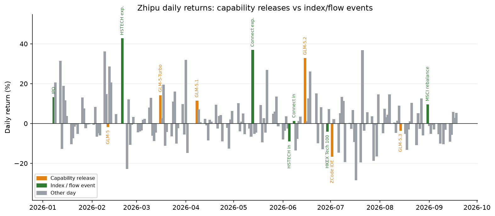

# Capability Surprise, Not Earnings Surprise
### An event-driven read of how the market prices an early-commercial-stage AI lab (Zhipu, 2513.HK)

> Core market data as of **2026-08-31**. For a foundation-model lab still spending more than twice its revenue on R&D,
> near-term earnings do not carry the same information as they do for a mature company. We therefore replace the
> classic *earnings* surprise with a **capability surprise** - a model release or benchmark-leaderboard jump - and ask the only question that matters for market efficiency: *does the price react once and stop, or does it
> keep drifting?* This is the AI analogue of post-earnings-announcement drift (PEAD) to **PCAD**.
>
> Method: mean-adjusted abnormal returns (`AR_t = R_t - average(R[-20,-6])`, where the average is the raw return
> over event days -20 through -6) on market prices through 2026-08-31; three windows:
> leakage `[-5,-1]`, reaction `[0,+1]`, drift `[+2,+10]`; robustness via peer-adjustment (benchmark = MiniMax).

---

## 1. Independently dated events, with prices as a descriptive cross-check
Event dates are taken from **official GLM release announcements**, not inferred from the price series. As a
*descriptive* cross-check, several of Zhipu's largest abnormal up-days coincide with these independently dated
events:

| Data-found spike | Daily ret | Matches |
|---|---:|---|
| 2026-02-09 to 02-11 | +36% | **GLM-5** launch |
| 2026-04-01 | +32% | run-up *into* **GLM-5.1** (leakage) |
| 2026-06-15 | +33% | **GLM-5.2** launch (first trading day after 06-13) |
| 2026-08-14 | -4% | **GLM-5.3** launch after a +26.5% mean-adjusted leakage window |
| 2026-02-20 / 05-13 | +43% / +37% | **non-capability: index/flow** (Hang Seng Tech inclusion + Stock Connect anticipation) |

The two flow-driven spikes are themselves a finding: not every move is capability; some is index/liquidity.
See `figures/fig2_daily_returns.png`.

## 2. Reaction is loud; drift is where efficiency breaks
Average CAR across the five GLM events (mean-adjusted):

| Window | Avg CAR | Read |
|---|---:|---|
| Leakage `[-5,-1]` | small | no systematic front-running |
| Reaction `[0,+1]` | **+13.7%** | four of five raw reactions are positive |
| Drift `[+2,+10]` | **+4.6%** (bimodal) | sign depends on release type; see below |

## 3. Three cases
- **GLM-5.2 (06-15) - under-reaction / momentum.** +30.8% reaction and **+28.2% further drift** across the
  complete nine-trading-day `[+2,+10]` window. A genuine SOTA jump (MIT open weights, 1M context) kept re-rating.
- **GLM-5.1 (04-08) - over-reaction / reversal.** +13.8% reaction then **-14.2% drift**: an *incremental*
  upgrade was "buy the rumor, sell the news"; see the peer-adjusted result in Section 5.
- **GLM-5.3 (08-14) - anticipation, then muted continuation.** The raw reaction is -6.5% after a +26.5%
  leakage window, but turns positive after MiniMax adjustment (+2.4% reaction; +1.8% drift).
- **MiniMax M2.7 / M3 - the cross-section test.** M2.7 had a -5.5% reaction and -49.1% drift; M3 had a
  -21.1% reaction and -40.8% drift. MiniMax de-rated while Zhipu kept climbing (`fig1`). Same sector, opposite paths: **capability surprise, not
  sector beta, drives the cross-section.**

## 4. Verdict
The market prices capability *quickly and discriminately* in this small sample, separating Zhipu from MiniMax on model quality rather than sector membership. It also appears to mis-time magnitude, under-reacting to genuine SOTA leaps and over-reacting to incremental releases. At the 31 August close, Zhipu traded at about **10.3x the IPO price and 340.5x LTM revenue through 2026H1**. We read that re-rating as **capability momentum priced as an option**. The fundamental anchor (DCF + real options) tells you *the level*;
the event study tells you *how price gets there*.

The 31 August boundary also prevents a tempting causal mistake. Zhipu rose 9.63% that day, while MSCI's August index changes took effect at the close. The H1 results announcement arrived at 18:56, after trading ended. The same-day return therefore cannot be treated as a response to the results; both the financial disclosure and MSCI rebalance stay in the extended catalog until a valid post-event window exists.

## 5. Robustness & honesty box
- **Peer-adjusted** (benchmark = MiniMax): all five reactions are positive and the mean rises from **+13.7% to
  +15.3%**; average drift strengthens from **+4.6% to +16.8%**. GLM-5.1's reversal flips to continuation
  (-14.2% to +12.9%), while GLM-5.3's raw negative reaction becomes +2.4%.
  The under-reaction/PCAD pattern is reinforced, not weakened.
- **Expanded event panel framework:** `data/event_catalog_input.csv` tracks Zhipu capability events,
  Zhipu screened-but-excluded model releases, Zhipu index/flow catalysts, MiniMax M2.5/M2.7/M3, MiniMax vertical
  audio/music releases, 16 complete-window releases from model issuers with their own traded securities, listing events,
  financial disclosures, and candidate Wenge/Moonshot/Kimi events. The July-August refresh adds Hy3,
  Qwen3.8-Max, Gemini 3.6/3.7 Flash and Muse Spark 1.1. Microsoft-for-OpenAI and Tesla-for-xAI observations
  remain auditable catalog entries but are excluded as issuer proxies. Only events with day-level dating, enough local price history and a clean event window enter the generated
  `eventstudy/event_panel.csv`; excluded candidates carry an explicit reason instead of being forced into the
  statistics. The input catalog now has 62 rows; 29 enter the computable panel.
- **Preliminary, diagnostic** evidence consistent with PCAD, *not* a proven anomaly: n = 5 single-firm events
  (+3 direct peer events) over seven months. The peer-adjusted reaction mean is at the 99.2nd percentile of the
  block-bootstrap null; drift is positive but only at the 88.0th percentile. Windows can overlap a fast release
  cadence or competing-lab news, so no general anomaly is claimed.
- Extensions: multi-lab panel (MiniMax, Wenge releases), NLP-scored surprise magnitude.

*Inputs: market prices through 2026-08-31 for the core Zhipu/MiniMax series in `data/`; CAR tables to `eventstudy/car_robustness.csv`; charts to `figures/`.*
