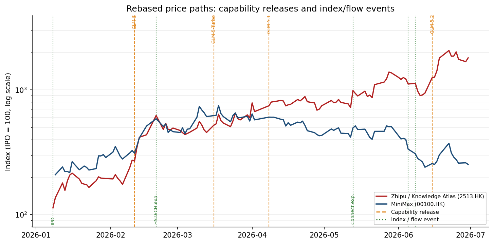
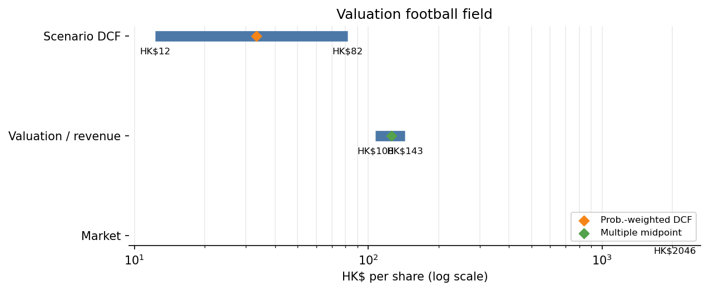
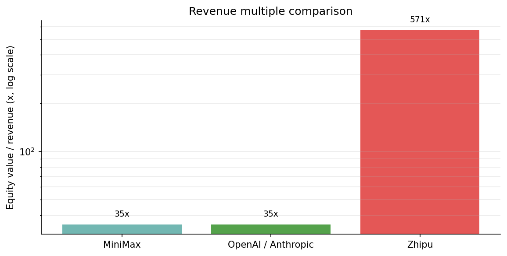
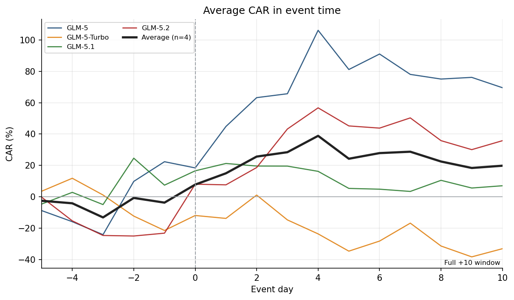
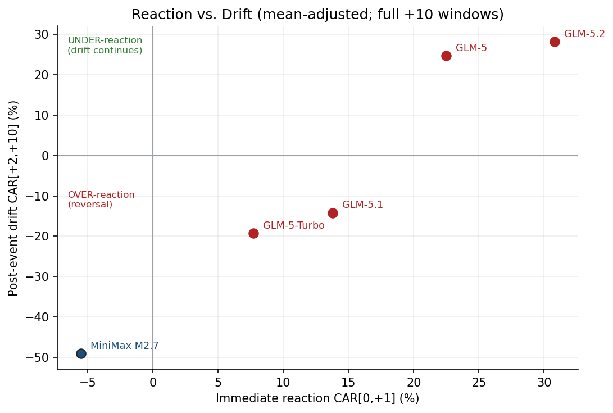

# 能力惊喜，而非盈余惊喜：智谱AI（2513.HK）估值与定价研究 | Capability Surprise, Not Earnings Surprise: Valuing Zhipu AI (2513.HK)

<p align="center">
  <a href="#中文"></a>
  &nbsp;
  <a href="#english"></a>
</p>

<p align="center">
  
  
  
  
  
</p>

> **作者 / Author:** Zhesheng Xu（许哲圣） · **学号 / Student ID:** 42353012 · 公司金融期末项目 / Corporate Finance Final Project
> **数据截至 / Data as of:** 2026-06-26

---

## 中文

### 一句话概览

本项目对全球**首家上市的基础大模型公司**——智谱AI（Knowledge Atlas，2513.HK，2026-01-08 经港交所第18C章上市）——做公司金融估值与定价机制研究。核心不是"算出一个目标价"，而是回答一个反直觉的问题：**一家 2026 年预计收入仅约 2 亿美元、深度亏损、净权益为负且云部署毛利率已跌至 −0.4% 的"早期商业化、尚未盈利"公司，为何上市约五个月暴涨约 17 倍、市值达约 1140 亿美元（股权价值/收入约 570 倍）？**

**主结论：** 这既不是单纯的泡沫，也不是有效定价，而是 **"对赢家通吃 AGI 结局的看涨期权 + 能力动量定价"**。基本面 DCF 概率加权约 HK$33/股（约为市价的 1.6%）；现价隐含 2035 年收入约 1300 亿美元、2026–2035 年约 105% 的年增速（9 个增长区间）。市场的价格发现已从"盈余惊喜"转向**"能力惊喜"**——围绕模型发布与榜单登顶定价。

### 快速导航

| 你想看什么 | 入口 |
|---|---|
| 研究问题与原创点 | [研究问题](#研究问题) |
| 双支柱论证结构 | [核心论点](#核心论点) |
| 估值结论（DCF/反向/可比） | [估值结论](#估值结论) |
| 能力惊喜事件研究 | [事件研究](#事件研究) |
| 港股AI新股横向（含中科闻歌） | [港股AI新股](#港股ai新股) |
| 关键图表 | [关键图表](#关键图表) |
| 数据来源 | [数据来源](#数据来源) |
| 如何编译论文 | [如何编译](#如何编译) |

### 研究问题

> 当一家公司**没有盈余可被"惊喜"**时，如何用公司金融理论为它估值，又如何检验市场对它的定价是否有效？

经典市场有效性检验依赖"盈余惊喜"事件研究（Ball-Brown 1968；Bernard-Thomas 1989）。但前沿大模型公司处于深度亏损、尚未盈利阶段，盈余无从"惊喜"。本文的处理方式：把信息事件由"盈余惊喜"替换为 **"能力惊喜"（capability surprise）**——即模型发布与基准榜单跃迁，并迁移国信证券《超预期投资全攻略》(2020) 的事件研究框架（CAR 三窗口）到这一新资产类别。

### 核心论点

论文采用**双支柱**结构，重心在估值与事件研究：

| 支柱 | 内容 | 结论 |
|---|---|---|
| **A — 基本面锚** | CAPM/WACC、三情景 DCF、反向 DCF、可比公司、实物期权 | 内在价值远低于市价；溢价的本质是期权时间价值 |
| **B — 原创实证** | 能力惊喜事件研究（GLM-5 → GLM-5.2，对照 MiniMax） | 市场对能力即时且有辨别力地反应，并有**初步证据**支持 PCAD 漂移 |

### 估值结论

WACC ≈ 13.5%（CAPM，自下而上 β≈1.6，Rf 4%，ERP 6%）；口径统一：HK$7.8/US$、RMB 7.1/US$、约 4.35 亿股。活公式模型见 [`model/valuation_model.xlsx`](model/valuation_model.xlsx)，十年完整 Base Case 链见论文附录 B。

| 情景 | 收入CAGR '26–35 | 终期利润率 | 股权价值 | 每股(HK$) |
|---|---:|---:|---:|---:|
| 悲观 (p=0.35) | 21% | 18% | $0.7B | 12 |
| 中性 (p=0.45) | 31% | 28% | $1.6B | 28 |
| 乐观 (p=0.20) | 46% | 35% | $4.6B | 82 |
| **概率加权** | — | — | **$1.9B** | **33** |
| *市价 (2026-06-26)* | — | — | *$114B* | *2,046* |

**反向 DCF：** 要支撑现价，需相信 2035 年收入约 **US$1000 亿**（约 **100%** 的十年复合增速，约数百倍 FY26E）——超级算力巨头级别。市场股权价值/收入约 **570×**，而 OpenAI/Anthropic 一级市场约 30–40×；**MiniMax 是最合适的直接可比对象，中科闻歌因商业模式不同而排除在倍数比较之外**。

### 事件研究

把模型发布/榜单事件当作信息事件，计算累计异常收益（CAR，均值调整；以 MiniMax 为基准做同业调整稳健性）。

| 事件 | Day 0 | 反应[0,+1] | 漂移[+2,+10] | 读数 |
|---|---|---:|---:|---|
| GLM-5 | 2026-02-11 | +22.5% | +24.7% | 反应不足 |
| GLM-5-Turbo | 2026-03-16 | +7.7% | −19.3% | 反转 |
| GLM-5.1 | 2026-04-08 | +13.8% | −14.2% | 过度反应 |
| GLM-5.2 | 2026-06-15 | +30.8% | +28.2%† | 强反应不足 |
| *MiniMax M2.7* | 2026-03-18 | −5.5% | −49.1% | 哑火/去估值 |
| **均值(4)** | | **+18.7%** | **+4.8%†** | |

† GLM-5.2 的 [+2,+10] 窗口**未走完**（截至 6/26 只覆盖 9 天中的 7 天），漂移为临时值。

**要点：** ① 事件日期独立取自官方发布公告（不靠股价倒推），图 2 仅作描述性交叉验证；② 反应一致为正（均值 +18.7%），漂移分化；③ **同业调整后漂移全部转正**（+4.8% → +19.2%），GLM-5.1 的"过度反应"翻为延续，说明其反转主要是板块效应；④ 2/20、5/13 两个尖峰为**非能力的指数/资金流事件**（恒生科技纳入、港股通预期）。结论定位为**初步诊断性证据**，4 个事件足以构成有趣的本科案例，但不足以确立普遍异象。

### 港股AI新股

2026 年港股 AI 新股分两类商业模式：

| 公司 | 代码 | 定位 | 上市表现 |
|---|---|---|---|
| 智谱AI | 2513.HK | 通用基础大模型实验室 | IPO HK$116.20 → ~HK$2,046（~+1,660%） |
| MiniMax | 00100.HK | 通用/多模态基础模型公司 | IPO HK$165 → ~HK$427（首日翻倍后回落） |
| 中科闻歌 Wenge AI | 01956.HK | 企业级决策大模型与 AI 解决方案商 | 2026-06-26 上市，IPO HK$60.70 → 首日 ~HK$111.7（+84%），市值 ~HK$105 亿 |

> *Recent Hong Kong AI listings include foundation-model laboratories such as Zhipu AI and MiniMax, as well as enterprise-focused AI platforms such as Wenge AI. However, Wenge AI is better classified as a decision-intelligence solution provider than as a direct frontier-model comparable.*

中科闻歌由中科院自动化所团队 2017 年创立，主打 DIOS 决策智能操作系统与 Decitron、雅意等模型，2025 年中国企业级决策智能大模型市场收入第一（~10.2% 份额）。因此它进入论文作为**港股 AI 新股横向语境**，而非估值倍数可比对象。

### 关键图表

<p align="center"></p>
<p align="center"></p>
<p align="center"></p>
<p align="center"></p>
<p align="center"></p>

### 数据来源

来源优先级：**HKEX 招股书与公告 > 官方模型卡/技术报告 > 恒生指数公司公告 > 正式市场数据库**；新闻媒体仅作佐证。

- **行情：** Tushare `hk_daily`（2513.HK、00100.HK、01956.HK）与 HKEX 日行情交叉核对，见 [`data/`](data/)。
- **财务：** 港交所第18C章招股书及 H1 2025 中报（论文附录 A）。
- **能力事件：** GLM/MiniMax 官方模型卡与 SWE-Bench Pro 等榜单。
- **指数/资金流：** 恒生指数公司指数调整公告、HKEX/SSE 港股通名单。

> ⚠️ 复现行情需自备 Tushare token，通过环境变量传入，切勿写入代码或提交到仓库。

### 项目结构

```text
.
├── paper/                 # 论文 XeLaTeX 源 (main.tex, refs.bib) 与 main.pdf
├── 42353012_许哲圣_*.pdf   # 按"学号_姓名_论文名"命名的提交版 PDF
├── model/                 # 活公式估值模型 valuation_model.xlsx
├── eventstudy/            # 事件研究 CAR 结果与 Base Case 预测 (csv)
├── figures/               # 论文/README 图表
├── data/                  # Tushare 行情 CSV
├── OUTLINE.md / DATA_TABLES.md / EVENT_STUDY.md  # 过程文档
```

### 如何编译

```bash
cd paper
python ../scripts/rebuild_outputs.py
# 需 TeX Live + XeLaTeX（封面含中文，必须用 xelatex；参考文献为内嵌 APA 列表，无需 bibtex）
xelatex -interaction=nonstopmode main.tex
xelatex -interaction=nonstopmode main.tex
```

---

## English

### At A Glance

A corporate-finance valuation and price-discovery study of the world's **first publicly listed
foundation-model company** — Zhipu AI (Knowledge Atlas, 2513.HK, listed on the HKEX Main Board under
Chapter 18C on 2026-01-08). The question is not a target price but a counter-intuitive one: **why did an
early-commercial-stage, pre-profit firm — ~US$200m expected 2026 revenue, deep losses, negative book equity,
and a cloud-deployment gross margin down to −0.4% — rise ~17x in five months to a ~US$114B market cap
(≈570× equity value / revenue)?**

**Main conclusion:** neither a simple bubble nor efficient pricing, but **a call option on a winner-take-all
AGI outcome, priced through capability momentum**. A disciplined DCF supports only ~HK$33/share (≈1.6% of
price); the price embeds ~US$130B of revenue by 2035 at a ~105% annual rate (2026–2035). Price discovery has shifted from *earnings
surprise* to **capability surprise** — pricing built around model releases and leaderboard wins.

### Core Argument — Two Pillars (weight on valuation + event study)

| Pillar | Content | Finding |
|---|---|---|
| **A — Fundamental anchor** | CAPM/WACC, three-scenario DCF, reverse DCF, comparables, real options | Intrinsic value far below market; the premium is option time value |
| **B — Original empirics** | Capability-surprise event study (GLM-5 → GLM-5.2 vs MiniMax) | Immediate, discriminating reaction, with **preliminary** evidence of PCAD drift |

### Valuation Summary (market row at 2026-06-26)

WACC ≈ 13.5% (CAPM, bottom-up β≈1.6). Conventions: HK$7.8/US$, RMB 7.1/US$, ≈435m shares. Live workbook:
[`model/valuation_model.xlsx`](model/valuation_model.xlsx); full ten-year Base case in the paper's Appendix B.

| Scenario | Rev. CAGR '26–35 | Term. margin | Equity | Per share (HK$) |
|---|---:|---:|---:|---:|
| Bear (p=0.35) | 21% | 18% | $0.7B | 12 |
| Base (p=0.45) | 31% | 28% | $1.6B | 28 |
| Bull (p=0.20) | 46% | 35% | $4.6B | 82 |
| **Prob-weighted** | — | — | **$1.9B** | **33** |
| *Market (2026-06-26)* | — | — | *$114B* | *2,046* |

**Reverse DCF:** justifying the price requires ~US$130B revenue by 2035 (~105% annual over 2026–2035, several hundred ×FY26E).
Market equity value / revenue ≈ 570× vs ~30–40× for OpenAI/Anthropic; **MiniMax is the appropriate direct comparable; Wenge AI is
excluded from the multiple comparison** (different business model).

### Event Study

| Event | Day 0 | Reaction [0,+1] | Drift [+2,+10] | Reading |
|---|---|---:|---:|---|
| GLM-5 | 2026-02-11 | +22.5% | +24.7% | under-reaction |
| GLM-5-Turbo | 2026-03-16 | +7.7% | −19.3% | reversal |
| GLM-5.1 | 2026-04-08 | +13.8% | −14.2% | over-reaction |
| GLM-5.2 | 2026-06-15 | +30.8% | +28.2%† | strong under-reaction |
| *MiniMax M2.7* | 2026-03-18 | −5.5% | −49.1% | muted / de-rate |
| **Average (4)** | | **+18.7%** | **+4.8%†** | |

† GLM-5.2's [+2,+10] window is truncated (7 of 9 days through 2026-06-26); its drift is provisional.

Independently-dated events; reaction is robust (mean-adj +18.7% vs peer-adj +18.5%),
and drift **strengthens to +19.2%** once the falling sector is removed (PCAD survives, GLM-5.1's reversal flips
to continuation). Two spikes (Feb-20, May-13) are non-capability index/flow events (Hang Seng Tech inclusion,
Stock Connect). Treated as **preliminary, diagnostic** evidence — an undergraduate case, not a general law.

### Repository Structure

```text
.
├── paper/      # Thesis XeLaTeX source (main.tex, refs.bib) and main.pdf
├── 42353012_许哲圣_*.pdf   # submission PDF named 学号_姓名_论文名
├── model/      # Live-formula valuation model
├── eventstudy/ # CAR results + Base-case projection (csv)
├── figures/    # Figures
└── data/       # Tushare market-data CSVs
```

### How to Build

```bash
cd paper
python ../scripts/rebuild_outputs.py
# XeLaTeX required (CJK cover); references are an inline APA list, so no bibtex step
xelatex -interaction=nonstopmode main.tex
xelatex -interaction=nonstopmode main.tex
```

> ⚠️ Reproducing the market data needs your own Tushare token via an environment variable — never commit it.

---

## License

MIT License — see [LICENSE](LICENSE). Copyright (c) 2026 Zhesheng Xu (许哲圣).
