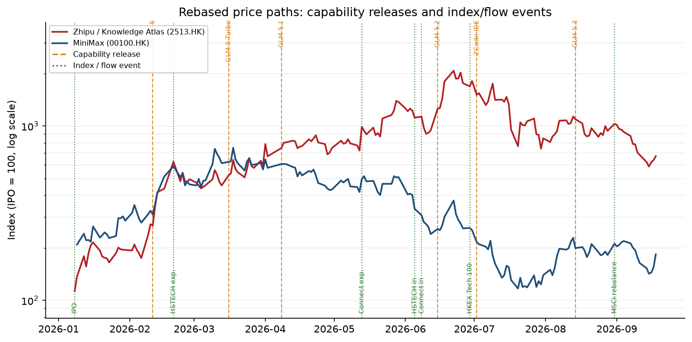
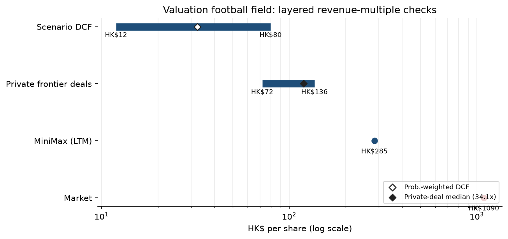
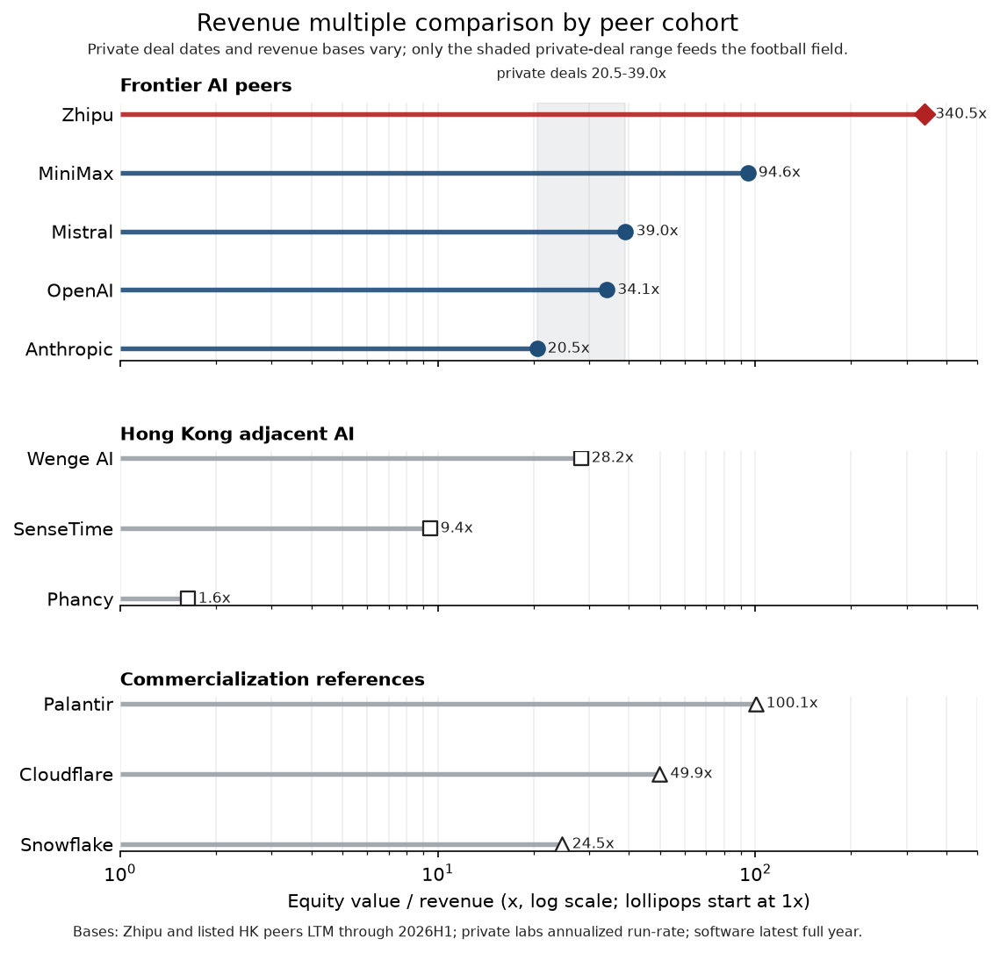
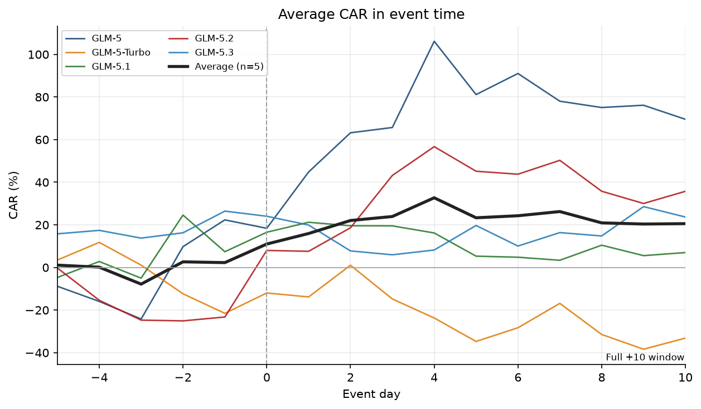
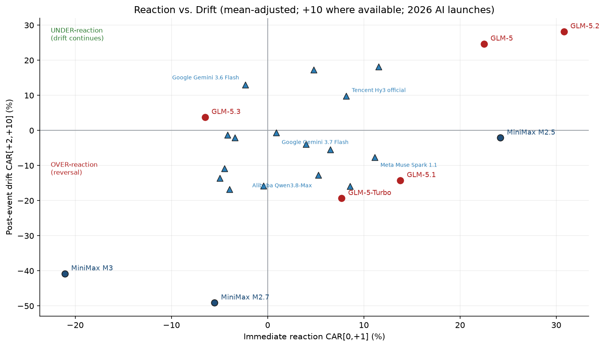

# 能力惊喜，而非盈余惊喜：智谱AI（2513.HK）估值与定价研究 | Capability Surprise, Not Earnings Surprise: Valuing Zhipu AI (2513.HK)

<p align="center">
  <a href="#中文"></a>
  &nbsp;
  <a href="#english"></a>
</p>

<p align="center">
  
  
  
  
  
</p>

> **作者 / Author:** Zhesheng Xu（许哲圣） · **学号 / Student ID:** 42353012 · 公司金融期末项目 / Corporate Finance Final Project
> **核心数据截至 / Core data as of:** 2026-08-28

---

## 中文

### 一句话概览

本项目研究全球**首家上市的基础大模型公司**智谱 AI。公司以 Knowledge Atlas 为上市主体，代码 2513.HK，2026 年 1 月 8 日经港交所第 18C 章上市。它 2025 年收入约 1.02 亿美元，2026 年预计收入约 2 亿美元，仍在深度亏损，净权益也为负。到了 2026 年 8 月 28 日，公司市值已经升到约 623 亿美元，股权价值约为 FY2026E 收入的 312 倍。本项目要解释这段价格如何形成，以及当前价格要求公司将来做到多大。

**主结论** 市场把智谱当作一张押注赢家通吃结果的长期看涨期权，并随模型能力的变化重新定价。基本面 DCF 的概率加权值约为 HK$32 每股，只占市价的 3.0%。现价要求 2035 年收入达到约 710 亿美元，2026 至 2035 年连续九个增长区间的年复合增速约为 92%。模型发布和榜单跃升已经成为这只股票最重要的信息事件。

### 快速导航

| 你想看什么 | 入口 |
|---|---|
| 研究问题与原创点 | [研究问题](#研究问题) |
| 双支柱论证结构 | [核心论点](#核心论点) |
| 估值结论（DCF/反向/可比） | [估值结论](#估值结论) |
| 能力惊喜事件研究 | [事件研究](#事件研究) |
| 港股AI新股横向（含中科闻歌） | [港股AI新股](#港股ai新股) |
| 关键图表 | [关键图表](#关键图表) |
| 数据来源 | [数据来源](#数据来源) |
| 如何编译论文 | [如何编译](#如何编译) |

### 研究问题

> 当一家公司**没有盈余可被"惊喜"**时，如何用公司金融理论为它估值，又如何检验市场对它的定价是否有效？

经典市场有效性检验依赖"盈余惊喜"事件研究（Ball-Brown 1968；Bernard-Thomas 1989）。前沿大模型公司仍在深度亏损，短期盈余很难承载市场最关心的信息。本文把模型发布和基准榜单跃迁定义为 **"能力惊喜"（capability surprise）**，再把国信证券《超预期投资全攻略》(2020) 的 CAR 三窗口框架迁移到这个新资产类别。

### 核心论点

论文采用**双支柱**结构，重心在估值与事件研究：

| 支柱 | 内容 | 结论 |
|---|---|---|
| **A — 基本面锚** | CAPM/WACC、三情景 DCF、反向 DCF、可比公司、实物期权 | 内在价值远低于市价；溢价的本质是期权时间价值 |
| **B — 原创实证** | 能力惊喜事件研究（GLM-5 → GLM-5.3，对照 MiniMax） | 市场对能力即时且有辨别力地反应，并有**初步证据**支持 PCAD 漂移 |

### 估值结论

WACC ≈ 13.5%（CAPM，自下而上 β≈1.6，Rf 4%，ERP 6%）；口径统一：HK$7.8/US$、RMB 7.1/US$、约 4.46 亿股。活公式模型见 [`model/valuation_model.xlsx`](model/valuation_model.xlsx)，十年完整 Base Case 链见论文附录 B。

| 情景 | 收入CAGR '26–35 | 终期利润率 | 股权价值 | 每股(HK$) |
|---|---:|---:|---:|---:|
| 悲观 (p=0.35) | 21% | 18% | $0.7B | 12 |
| 中性 (p=0.45) | 31% | 28% | $1.6B | 27 |
| 乐观 (p=0.20) | 46% | 35% | $4.6B | 80 |
| **概率加权** | — | — | **$1.9B** | **32** |
| *市价 (2026-08-28)* | — | — | *$62.3B* | *1,090* |

**反向 DCF** 要支撑现价，需相信 2035 年收入约 **US$710 亿**，对应 2026 至 2035 年约 **92%** 的年复合增速和约 355 倍 FY26E 收入。

**分层可比** MiniMax 按 2026 年 8 月 28 日市值和截至 2026H1 的 LTM 收入重算为 **81.4×**；智谱为 **311.5× FY2026E 收入**。

OpenAI、Anthropic 与 Mistral 的私有交易参照落在 **20.5 至 39.0×**，中位数为 **34.1×**。只有这个区间进入 football field，对应智谱每股约 HK$72 至 136。MiniMax 的上市倍数单独计算，对应约 HK$285。两种结果都明显低于 HK$1,090。

SenseTime、Phancy 和中科闻歌放在港股邻近组。Palantir、Cloudflare 和 Snowflake 放在商业化参照组。它们能帮助读者判断港股 AI 资产和成熟 AI 软件的估值位置，商业模式与收入结构却和基础模型实验室差别很大，因此不参与核心中位数。逐行口径、估值日和来源见 [`data/valuation_comps.csv`](data/valuation_comps.csv)。

### 事件研究

把模型发布/榜单事件当作信息事件，计算累计异常收益（CAR，均值调整；以 MiniMax 为基准做同业调整稳健性）。

| 事件 | Day 0 | 反应[0,+1] | 漂移[+2,+10] | 读数 |
|---|---|---:|---:|---|
| GLM-5 | 2026-02-11 | +22.5% | +24.7% | 反应不足 |
| GLM-5-Turbo | 2026-03-16 | +7.7% | −19.3% | 反转 |
| GLM-5.1 | 2026-04-08 | +13.8% | −14.2% | 过度反应 |
| GLM-5.2 | 2026-06-15 | +30.8% | +28.2% | 强反应不足 |
| GLM-5.3 | 2026-08-14 | −6.5% | +3.8% | 发布前抢跑；同业调整后为正 |
| *MiniMax M2.7* | 2026-03-18 | −5.5% | −49.1% | 哑火/去估值 |
| *MiniMax M3* | 2026-06-01 | −21.1% | −40.8% | 催化失败/去估值 |
| **均值(5)** | | **+13.7%** | **+4.6%** | |

均值调整口径：`AR_t = R_t - average(R[-20,-6])`。截至 2026-08-28，GLM-5.2 与 GLM-5.3 的 [+2,+10] 窗口均覆盖完整 9 个交易日。GLM-5.3-Flash 因后续窗口不足仅进入扩展目录。

**要点：** ① 事件日期独立取自官方发布公告（不靠股价倒推）；② 原始短窗 5 次中 4 次为正，均值 +13.7%；③ **同业调整后 5/5 的反应与漂移均为正**，均值分别为 +15.3% / +16.8%，GLM-5.1 的"过度反应"翻为延续，GLM-5.3 的原始负反应也翻为 +2.4%；④ 2/20、5/13 两个尖峰为**非能力的指数/资金流事件**。结论定位为**初步诊断性证据**，5 个事件足以构成有趣的本科案例，但不足以确立普遍异象。

### 港股 AI 参照公司

截至 2026 年 8 月 28 日，港股 AI 参照公司可按业务分为基础模型实验室和企业 AI 平台。

| 公司 | 代码 | 定位 | 上市表现 |
|---|---|---|---|
| 智谱AI | 2513.HK | 通用基础大模型实验室 | IPO HK$116.20 → HK$1,090（+838%） |
| MiniMax | 00100.HK | 通用/多模态基础模型公司 | IPO HK$165 → HK$300.4（+82%，首日翻倍后大幅回落） |
| SenseTime 商汤 | 00020.HK | 生成式 AI、计算机视觉与解决方案平台 | 2026-08-28 收盘 HK$1.48，约 9.7× LTM 收入 |
| Phancy 范式智能 | 06682.HK | 企业 AI 平台与智能体服务 | 2026-08-28 收盘 HK$27.76，约 1.6× LTM 收入 |
| 中科闻歌 Wenge AI | 01956.HK | 企业级决策大模型与 AI 解决方案商 | 2026-06-26 上市，IPO HK$60.70 → HK$87.8；约 28.8× LTM 收入 |

> *Recent Hong Kong AI listings include foundation-model laboratories such as Zhipu AI and MiniMax, as well as enterprise-focused AI platforms. Wenge AI is an enterprise decision-intelligence provider and belongs in the Hong Kong-adjacent cohort.*

中科闻歌由中科院自动化所团队 2017 年创立，主打 DIOS 决策智能操作系统与 Decitron、雅意等模型，2025 年中国企业级决策智能大模型市场收入第一（~10.2% 份额）。SenseTime、Phancy 和中科闻歌都保留在港股邻近组。它们的收入结构与基础模型实验室差别很大，因此只展示倍数，不参与核心中位数。

### 关键图表

<p align="center"></p>
<p align="center"></p>
<p align="center"></p>
<p align="center"></p>
<p align="center"></p>

### 数据来源

来源优先级：**HKEX 招股书与公告 > 官方模型卡/技术报告 > 恒生指数公司公告 > 正式市场数据库**；新闻媒体仅作佐证。

- **行情：** Tushare `hk_daily`；受频率/权限限制时以腾讯财经（港股）和 Nasdaq（美股）公开日线补齐并交叉核对，见 [`data/`](data/)。
- **财务：** 港交所第18C章招股书及 2025 年度报告（论文附录 A）。
- **估值可比** 输入表与生成表分别见 [`data/valuation_comps_input.csv`](data/valuation_comps_input.csv) 和 [`data/valuation_comps.csv`](data/valuation_comps.csv)，逐行保留估值日、收入周期、币种和来源。
- **AGM 通函：** 2026年6月22日股东大会投票结果公告（确认总股本 445,843,090 股、股权激励方案等 20 项决议全票通过）。
- **能力事件：** GLM/MiniMax 官方模型卡、ZCode 发布与 SWE-Bench Pro 等榜单。
- **指数/资金流：** 恒生指数公司指数调整公告、HKEX/SSE 港股通名单。

> ⚠️ Tushare token 仅通过环境变量传入，切勿写入代码或提交到仓库；无权限时可运行公开来源回退模式。

### 项目结构

```text
.
├── paper/                 # 论文 XeLaTeX 源 (main.tex) 与 main.pdf
├── 42353012_许哲圣_*.pdf   # 按"学号_姓名_论文名"命名的提交版 PDF
├── model/                 # 活公式估值模型 valuation_model.xlsx
├── eventstudy/            # 事件研究 CAR 结果与 Base Case 预测 (csv)
├── figures/               # 论文/README 图表
├── data/                  # 行情与分层估值可比口径 CSV
├── OUTLINE.md / DATA_TABLES.md / EVENT_STUDY.md  # 过程文档
```

### 如何编译

```bash
python scripts/build_project.py
```

手动等价命令：

```bash
cd paper
python ../scripts/rebuild_outputs.py
python ../scripts/comps_beta_and_reverse_dcf.py
# 需 TeX Live + XeLaTeX（封面含中文，必须用 xelatex；参考文献为内嵌 APA 列表，无需 bibtex）
xelatex -interaction=nonstopmode main.tex
xelatex -interaction=nonstopmode main.tex
cd ..
python scripts/validate_outputs.py
```

---

## English

### At A Glance

A corporate-finance valuation and price-discovery study of the world's **first publicly listed
foundation-model company** — Zhipu AI (Knowledge Atlas, 2513.HK, listed on the HKEX Main Board under
Chapter 18C on 2026-01-08). The question is not a target price but a counter-intuitive one: **why did an
early-commercial-stage, pre-profit firm — ~US$200m expected 2026 revenue, deep losses, negative book equity,
and volatile cloud-deployment economics — rise ~9.4x in under eight months to a ~US$62.3B market cap
(≈312× equity value / revenue)?**

**Main conclusion:** neither a simple bubble nor efficient pricing, but **a call option on a winner-take-all
AGI outcome, priced through capability momentum**. A disciplined DCF supports only ~HK$32/share (≈3.0% of
price); the price embeds ~US$71B of revenue by 2035 at a ~92% annual rate (2026–2035). Price discovery has shifted from *earnings
surprise* to **capability surprise** — pricing built around model releases and leaderboard wins.

### Core Argument — Two Pillars (weight on valuation + event study)

| Pillar | Content | Finding |
|---|---|---|
| **A — Fundamental anchor** | CAPM/WACC, three-scenario DCF, reverse DCF, comparables, real options | Intrinsic value far below market; the premium is option time value |
| **B — Original empirics** | Capability-surprise event study (GLM-5 → GLM-5.3 vs MiniMax) | Immediate, discriminating reaction, with **preliminary** evidence of PCAD drift |

### Valuation Summary (market row at 2026-08-28)

WACC ≈ 13.5% (CAPM, bottom-up β≈1.6). Conventions: HK$7.8/US$, RMB 7.1/US$, ≈446m shares. Live workbook:
[`model/valuation_model.xlsx`](model/valuation_model.xlsx); full ten-year Base case in the paper's Appendix B.

| Scenario | Rev. CAGR '26–35 | Term. margin | Equity | Per share (HK$) |
|---|---:|---:|---:|---:|
| Bear (p=0.35) | 21% | 18% | $0.7B | 12 |
| Base (p=0.45) | 31% | 28% | $1.6B | 27 |
| Bull (p=0.20) | 46% | 35% | $4.6B | 80 |
| **Prob-weighted** | — | — | **$1.9B** | **32** |
| *Market (2026-08-28)* | — | — | *$62.3B* | *1,090* |

**Reverse DCF:** justifying the price requires ~US$71B revenue by 2035 (~92% annual over 2026–2035, ~355×FY26E).
Zhipu trades at about **311.5× FY2026E revenue**. The closest listed peer, MiniMax, is **81.4× LTM revenue**.
Paired private-market references for OpenAI, Anthropic, and Mistral run from **20.5× to 39.0×**, with a **34.1× median**.
That private range implies about HK$72 to HK$136 per Zhipu share, while the MiniMax multiple implies about HK$285; both remain well below HK$1,090.
SenseTime, Phancy, and Wenge AI form a separate Hong Kong-adjacent cohort, while Palantir, Cloudflare, and Snowflake are commercialization references. Neither cohort enters the private-deal range. Row-level bases and sources are in [`data/valuation_comps.csv`](data/valuation_comps.csv).

### Event Study

| Event | Day 0 | Reaction [0,+1] | Drift [+2,+10] | Reading |
|---|---|---:|---:|---|
| GLM-5 | 2026-02-11 | +22.5% | +24.7% | under-reaction |
| GLM-5-Turbo | 2026-03-16 | +7.7% | −19.3% | reversal |
| GLM-5.1 | 2026-04-08 | +13.8% | −14.2% | over-reaction |
| GLM-5.2 | 2026-06-15 | +30.8% | +28.2% | strong under-reaction |
| GLM-5.3 | 2026-08-14 | −6.5% | +3.8% | anticipated; positive peer-adjusted reaction |
| *MiniMax M2.7* | 2026-03-18 | −5.5% | −49.1% | muted / de-rate |
| *MiniMax M3* | 2026-06-01 | −21.1% | −40.8% | failed catalyst / de-rate |
| **Average (5)** | | **+13.7%** | **+4.6%** | |

Mean-adjusted definition: `AR_t = R_t - average(R[-20,-6])`. As of 2026-08-28, GLM-5.2 and GLM-5.3 both have complete nine-day [+2,+10] windows; GLM-5.3-Flash remains catalog-only because its post-event window is incomplete.

Independently dated events: mean reaction rises from +13.7% raw to +15.3% peer-adjusted, while drift
**strengthens from +4.6% to +16.8%**; all five peer-adjusted reactions and drifts are positive. Two spikes
(Feb-20, May-13) are non-capability index/flow events (Hang Seng Tech inclusion,
Stock Connect). Treated as **preliminary, diagnostic** evidence — an undergraduate case, not a general law.

### Repository Structure

```text
.
├── paper/      # Thesis XeLaTeX source (main.tex) and main.pdf
├── 42353012_许哲圣_*.pdf   # submission PDF named 学号_姓名_论文名
├── model/      # Live-formula valuation model
├── eventstudy/ # CAR results + Base-case projection (csv)
├── figures/    # Figures
└── data/       # Tushare / Tencent Finance / Nasdaq market-data CSVs
```

### How to Build

```bash
python scripts/build_project.py
```

Quick checks:

```bash
python -m unittest discover -s tests
python scripts/validate_outputs.py
```

Manual equivalent:

```bash
cd paper
python ../scripts/rebuild_outputs.py
python ../scripts/comps_beta_and_reverse_dcf.py
# XeLaTeX required (CJK cover); references are an inline APA list, so no bibtex step
xelatex -interaction=nonstopmode main.tex
xelatex -interaction=nonstopmode main.tex
cd ..
python scripts/validate_outputs.py
```

> ⚠️ Pass any Tushare token only through an environment variable; the updater can use public fallbacks when permissions bind.

---

## License

MIT License — see [LICENSE](LICENSE). Copyright (c) 2026 Zhesheng Xu (许哲圣).
